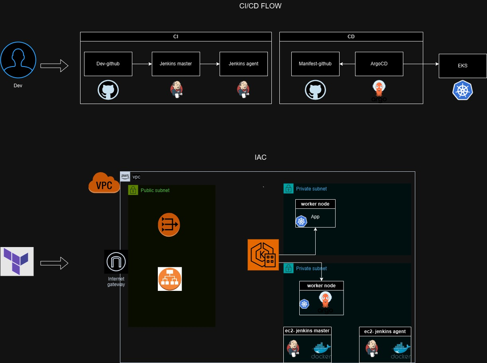

# Gitops CI/CD Project
### Create vpc in AWS with Terraform
### Create eks cluster and ArgoCD with Terraform
### Jenkins pipeline for build test and trigger ArgoCD (GitOps)
### This project have two repo: Dev repo and Manifest repo
#### NOTE: All the secret saved in Jenkins
#


## Terraform - Terraform have 3 module:
* VPC
* EKS
* ArgoCD (ALB)
#### NOTE: The state file saved in s3 bucket
#### EKS worker on two AZ
Create all the resource
```
terraform init
terraform plan
terrafor apply -auto-approve
```

## ArgoCD - Login
```
export ARGOCD_SERVER=`kubectl get svc argocd-server -n argocd -o json | jq --raw-output '.status.loadBalancer.ingress[0].hostname'`

export ARGO_PWD=`kubectl -n argocd get secret argocd-initial-admin-secret -o jsonpath="{.data.password}" | base64 -d`

argocd login $ARGOCD_SERVER --username admin --password $ARGO_PWD --insecure

```

## Jenkins Pipeline (not with terraform)
### CI pipeline
* PULL
* VERIFY
* BUILD
* TEST
* PUSH
* TRIGGER CD PIPELINE
* MESSAGE
#### The pipeline will test all the branches but deploy only the main branch

### CD pipeline
* PULL
* CONNECT TO ARGOCD
* CHANGE MANIFEST
* CREATE THE APP IF NEEDED IN ARGOCD


# Advance- sealed secret

## Sealed k8s secret
1. Create secret with base64 for the DockerHub
2. Install secret manager in k8s
```
# kubeseal
wget https://github.com/bitnami-labs/sealed-secrets/releases/download/v0.18.0/kubeseal-0.18.0-linux-amd64.tar.gz
tar xfz kubeseal-0.18.0-linux-amd64.tar.gz
sudo install -m 755 kubeseal /usr/local/bin/kubeseal

# secret manager controller (kube-system)
wget https://github.com/bitnami-labs/sealed-secrets/releases/download/v0.18.0/controller.yaml
kubectl apply -f controller.yaml

```
3. Sealed the secret
```

* run secret without apply in k8s for create kubeseal secret

# kubeseal --format=yaml: Encrypts the secret using the Sealed Secrets public key from the controller in the cluster and outputs it in YAML format.

kubectl create -f secret.yaml --dry-run=client -o yaml | kubeseal --format=yaml > my-sealed-secret.yaml

```


